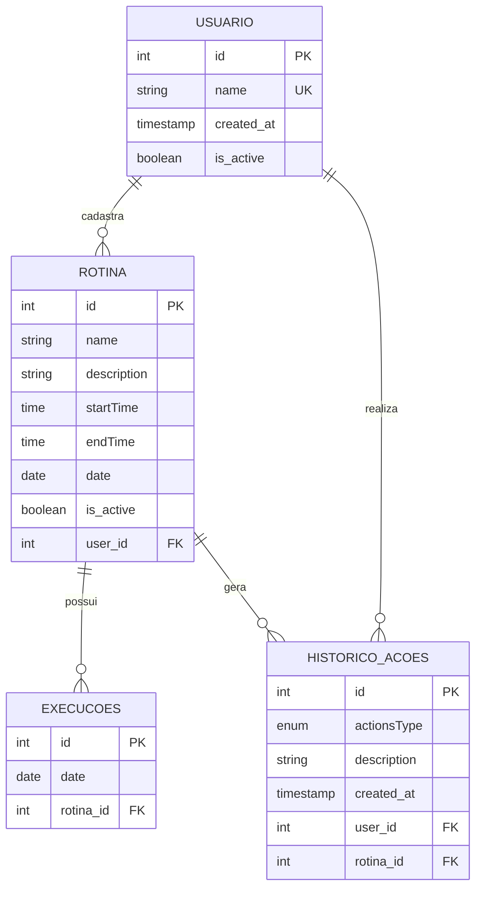

# Sistema de Gerenciamento de Rotinas Pessoais

## Descrição do Sistema

### Problema real
Na sociedade atual, o excesso de informações e de responsabilidades diárias torna extremamente difícil manter a consistência em hábitos e metas de longo prazo (como rotinas de estudo, leitura ou exercícios físicos). Para tentar se organizar, as pessoas costumam depender apenas da memória, de alarmes soltos no celular ou de anotações desestruturadas em papel.

Isso gera três consequências graves:

* **Sobrecarga Cognitiva**: O estresse e a ansiedade constantes de ter que se lembrar ativamente de tudo o que precisa ser feito no dia.

* **Falta de Visibilidade**: Sem um histórico registrado, o indivíduo perde a noção do próprio progresso (não sabe se estudou 2 ou 5 vezes na semana passada).

### Proposta
Este projeto consiste em uma aplicação backend desenvolvida para o gerenciamento de rotinas pessoais. O sistema permite que os usuários se cadastrem na plataforma e registrem suas atividades recorrentes diárias, como momentos de estudo, práticas de exercícios físicos, entre outras. 
### Funcionalidades
A aplicação oferece as seguintes funcionalidades principais:
* **Gestão de Rotinas:** Criação, listagem e alternância de status (ativação e desativação) das rotinas cadastradas.
* **Registro de Execução:** Acompanhamento e registro diário da execução de cada rotina do usuário.
* **Trilha de Auditoria (Logs):** Registro de todas as ações relevantes realizadas no sistema, incluindo a criação de novas rotinas, marcação de execuções e alterações de status das atividades.

O foco central da aplicação é garantir a consistência dos dados do usuário por meio de validações rigorosas que controlam o estado atual das rotinas e a frequência de seus registros diários.

### Tecnologias utilizadas

#### Backend & Framework

* **Python (3.8+)**: Linguagem de programação principal do projeto;
* **Flask**: Microframework web utilizado para construir a aplicação, gerenciar as rotas e a lógica do servidor;
* **JinJa2 & Werkzeug**: Motores base do Flask utilizados para renderizar as páginas HTML de forma dinâmica.

#### Banco de Dados & ORM
* **MySQL**: Banco de dados relacional principal da aplicação;
* **PyMySQL**: Driver de conexão que permite o Python se comunicar com o MySQL;
* **Flask-SQLAlchemy**: Ferramenta de ORM (Object-Relational Mapping) para interagir com o banco de dados usando código Python em vez de comandos SQL puros;
* **Flask-Migrate/Alembic**: Gerenciadores de migração para manter o histórico de alterações das tabelas do banco de dados;
* **SQLite**: Utilizado em memória (`:memory:`) exclusivamente para rodar os testes automatizados.
* **PostgreSQL & Supabase**: Banco de dados em nuvem como Data Base de produção funcionando no website.

#### Segurança & Configuração
* **Cryptography**: Biblioteca de segurança utilizada para gerar os hashes e proteger as senhas dos usuários;
* **Python-dotenv**: Gerenciador de variáveis de ambiente para esconder dados sensíveis (como senhas do banco de dados) no arquivo `.env`.

#### Qualidade de Código & Testes
* **Pylint**: Ferramentas de análise estática (Linter) para garantir que o código siga as boas práticas e o padrão internacional PEP 8;
* **Pytest**: Framework utilizado para a criação e execução dos testes automatizados (Testes de Unidade e Integração).

#### DevOps & Infraestrutura
* **Github Action**: Plataforma de CI/CD configurada para rodar a esteira de Integração Contínua (instalação, linting e testes) a cada novo push ou pull request;
* **Setuptools & Pip**: Ferramentas de empacotamento e gerenciamento de dependências (`pyproject.toml` e `requirements.txt`).
* **Render**: Site de hospedagem de repositórios escolhida para deploy do projeto por sua facilidade com projetos Flask

#### Frontend
* **HTML/CSS**: Estruturação e estilização das telas do sistema, [/templates](/src/templates/) e [/static](/src/static/)
* **JavaScript**: Responsável pela interatividade do dashboard, incluindo a inicialização do calendário, requisições à API de feriados via `fetch`, e manipulação do DOM para exibição dos modais;
* **FullCalendar (v6.1.11)**: Biblioteca JavaScript utilizada para renderizar o calendário anual interativo no dashboard. Carregada via CDN, é configurada com localização em português (`pt-br`) e customizada com indicadores visuais por dia e abertura de modais ao clicar em uma data.


#### Árvore de pastas
```
Gerenciador-de-Rotina/
├── src/
│   ├── blueprints/
│   │   ├── home/
│   │   │   ├── __init__.py
│   │   │   └── routes.py
│   │   ├── user/
│   │   │   ├── __init__.py
│   │   │   └── routes.py
│   │   └── task/
│   │       ├── __init__.py
│   │       └── routes.py
│   ├── static/
│   │   ├── css/
│   │   │   ├── root.css
│   │   │   ├── errors/
│   │   │   ├── task/
│   │   │   └── user/
│   │   ├── js/
│   │   │   └── user/
│   │   │       └── dashboard.js
│   │   └── img/
│   │       └── logo-ceub.png
│   ├── templates/
│   │   ├── base.html
│   │   ├── errors/
│   │   │   └── 404.html
│   │   ├── home/
│   │   │   └── home.html
│   │   ├── task/
│   │   │   ├── edit.html
│   │   │   └── register.html
│   │   └── user/
│   │       ├── dashboard.html
│   │       ├── login.html
│   │       ├── register.html
│   │       └── update.html
│   ├── extentions.py
│   └── models.py
├── tests/
│   ├── conftest.py
│   ├── test_integration.py
│   ├── test_models.py
│   └── test_routes.py
├── config.py
└── requirements.txt
```

## Explicação das Tabelas

O banco de dados (`db_rotinas`) foi modelado de forma relacional e simples, composto por 4 tabelas principais:

* **usuario:** Armazena os dados básicos de quem usa o sistema (`idusuario`, `nome`, `criado_em`). Como é um sistema simplificado, não exige senha.
* **rotina:** Guarda as atividades criadas pelo usuário. Possui um vínculo direto com o criador (`usuario_idusuario`), o nome da atividade e um indicador (`ativa`) para saber se a rotina está em andamento ou pausada.
* **execucoes:** Registra cada vez que uma rotina é concluída no dia. Vincula-se à rotina executada (`rotina_idrotina`) e guarda a data exata da execução (`data_execucao`). 
* **historico_acoes:** Tabela de log e auditoria. Salva o histórico de eventos importantes (`tipo_acao`), vinculando a ação ao usuário e à rotina correspondente, além do momento exato do ocorrido.

arquivo para montagem do banco de dados no **`MySQL`** foi disponibilizado [aqui](/document/dbScripts/db_create.sql).

### Modelo conceitual de Banco de Dados

para a visualização do modelo conceitual na IDE VS Code, é recomendado baixar a extenção **`Markdown Preview Mermaid Support`**



## Lista de Rotas
* **home (/)**: página inicial para registrar usuário ou fazer login
### Usuário
* **register (/user/register)**: página para fazer cadastro do usuário
* **login (/user/login)**: página pra entrar com uma conta já existente
* **update (/user/update)**: página para alterar os dados do usuário
* **delete (/user/delete/{int:user_id})**: página para deletar o usuário
* **dashboard (/user/dashboard/{int:user_id})**: página para gerenciamento de informações e rotinas do usuário
### Rotina
* **create (/task/create)**: página para fazer cadastro da rotina
* **update (/task/update)**: página para editar a rotina
* **delete (/task/delete/{int:task_id})**: página para deletar rotina
* **feriados (/task/feriados)**: uma rota de API que retorna um JSON com todos os feriados do ano
## Explicação das Regras de Negócio

O sistema foi desenhado para garantir a consistência no acompanhamento das rotinas e manter um registro confiável de auditoria. As principais regras de negócio implementadas são:

1. **Unicidade de Execução Diária:** * Uma rotina só pode ser registrada como "concluída" ou "executada" uma única vez por dia.
   * O banco de dados garante essa integridade através de uma restrição única (`UniqueConstraint`) cruzando o ID da rotina e a data da execução. Tentativas de registrar a mesma rotina duas vezes no mesmo dia serão bloqueadas.

2. **Validação de Status da Rotina (Ativa/Inativa):**
   * Apenas rotinas com o status "ativo" (`is_active = True`) podem receber novos registros de execução.
   * Rotinas desativadas ou pausadas servem apenas para consulta de histórico, evitando inconsistências nos dados de progresso atual do usuário.

3. **Auditoria Contínua (Trilha de Logs):**
   * Nenhuma alteração crítica pode passar despercebida. Todas as ações do tipo `CREATE` (Criação), `UPDATE` (Atualização) e `DELETE` (Remoção) realizadas no sistema devem obrigatoriamente gerar um registro imutável na tabela `historico_acoes`.
   * Esse registro guarda o autor da ação, qual rotina foi afetada (se aplicável), a descrição do evento e o carimbo exato de data e hora (`created_at`).

4. **Integridade Relacional (Exclusão Segura):**
   * Para evitar registros "órfãos" no banco de dados, a exclusão de um usuário não pode ser feita de forma arbitrária.
   * Ao deletar um usuário, o sistema deve garantir que o histórico de ações atrelado a ele seja devidamente tratado ou limpo primeiro, respeitando as chaves estrangeiras (Foreign Keys).

## Calendário e API de Feriados
Atualização da aplicação substituindo a listagem semanal de rotinas por um calendário anual interativo, permitindo que o usuário visualize e gerencie suas rotinas em datas específicas ao longo do ano.

### Calendário
Implementado com a biblioteca **FullCalendar**, o calendário exibe indicadores visuais nos dias com rotinas agendadas. Ao clicar em um dia, um modal é exibido com todas as atividades agendadas para aquela data, com opções de edição e exclusão.

### API de Feriados
Integração com a API [Invertexto](https://api.invertexto.com/) para exibição dos feriados e pontos facultativos nacionais diretamente no calendário. Os feriados são destacados em vermelho e os facultativos em laranja, diferenciando-os visualmente das rotinas do usuário.

A chave de acesso à API é armazenada como variável de ambiente (`TOKEN_FERIADO`) e a comunicação é feita por uma rota proxy no servidor, garantindo que a chave nunca seja exposta no frontend.

## Instruções para Execução do Projeto
### Preparação de Ambiente
Para a preparação do ambiente, copie os códigos abaixo no terminal da IDE:
```
python -m venv venv_desenvolvimento
```
```
Set-ExecutionPolicy RemoteSigned -Scope CurrentUser
```
```
.\venv_desenvolvimento\Scripts\activate
```


### Criação do arquivo `.env`
É necessario a criação de um arquivo `.env` para configuração do banco de dados.
Crie uma um arquivo com o nome `.env` e coloquei as seguintes variáveis:
#### Variáveis padrões
* SECRET_KEY = {chave_secreta}
* TOKEN_FERIADO={chave_da_api}
#### Variáveis de desenvolvimento
* DB_USER = {nome_do_perfil_do_usuário}
* DB_PASSWORD = {senha_de_acesso}
* DB_HOST = localhost
* DB_PORT = 3306 (ou outra porta configurada)
* DB_NAME = {nome_do_db}
#### Variáveis de produção
* FLASK_ENV= production ou development
* DATABASE_URL=postgresql://...

### Bibliotecas a serem baixadas
As bibliotecas que serão baixadas no projeto estarão disponíveis no arquivo [requirement.txt](/requirements.txt)

Copie o codigo abaixo no terminal, dentro do ambiente `(venv_desenvolvimento)`:
```
pip install -r requirements.txt
```
### Execução do programa
Para executar o programa só precisa clicar no botão de **run** no arquivo [run.py](/run.py)

Ou executar no terminal, dentro do ambiente `(venv_desenvolvimento)` o comando abaixo:
```
python run.py
```
---
**Versão Atual**: 2.4.0

**Autores**: João Pedro de Melo Naves

**Link do Repositório**: [Sistema de Gerenciamento de Rotinas Pessoais](https://github.com/BirdMelo/CEUB-DevWeb-Avaliacao)
**Deploy**: [gerenciamento-de-rotina.onrender.com](https://gerenciador-de-rotina.onrender.com)